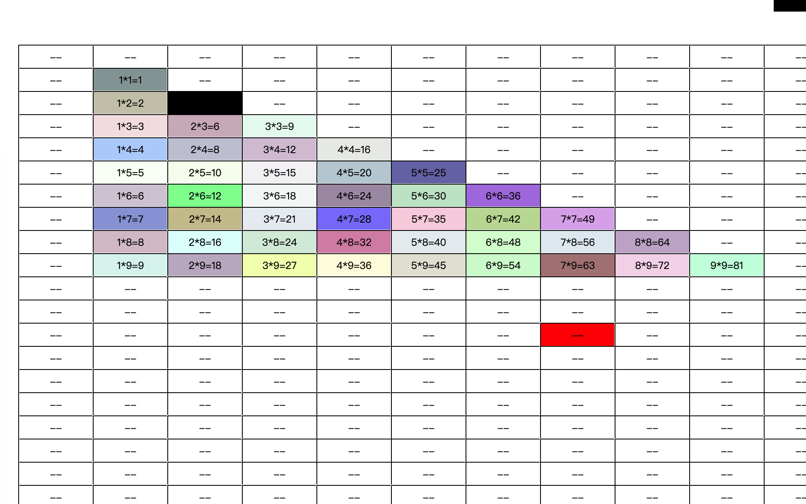
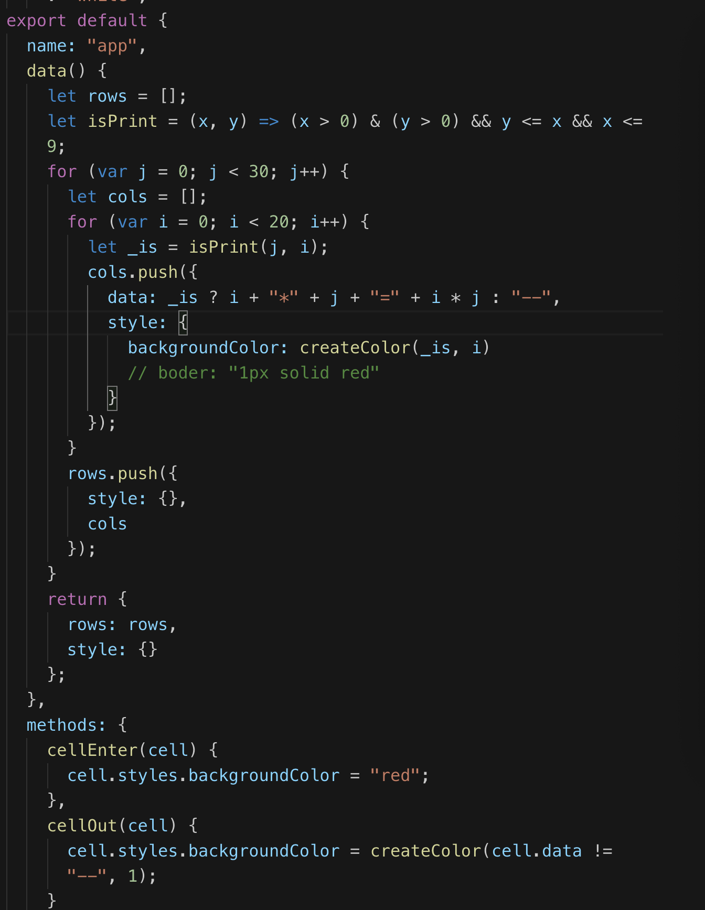

# vue-canvas-table

基于 VUE 组件实现 canvas 表格

[演示地址:http://halvee.com/demo/canvastable/index.html][url]
[url]:http://halvee.com/demo/canvastable/index.html 'demo'
效果图



示例代码

```
<vc-table
     :styles="style"
     :width="1000"
     :height="600"
     style="margin-bottom:20px;margin-left:50px;cursor:pointer;margin-top:100px;"
     @cell-enter="cellEnter"
     @cell-out="cellOut"
   >
     <vc-row :key="ri" v-for="(row,ri) in rows">
       <vc-col :key="ci" :data="col.data" :styles="col.style" v-for="(col,ci) in row.cols">
       {{cell.data}}
         <!-- <vc-text>{{'单元格'+col.data}}</vc-text> -->
       </vc-col>
     </vc-row>
   </vc-table>
```



## Project setup

```
yarn install
```

### Compiles and hot-reloads for development

```
yarn run serve
```

### Compiles and minifies for production

```
yarn run build
```

### Run your tests

```
yarn run test
```

### Lints and fixes files

```
yarn run lint
```

### Customize configuration

See [Configuration Reference](https://cli.vuejs.org/config/).
